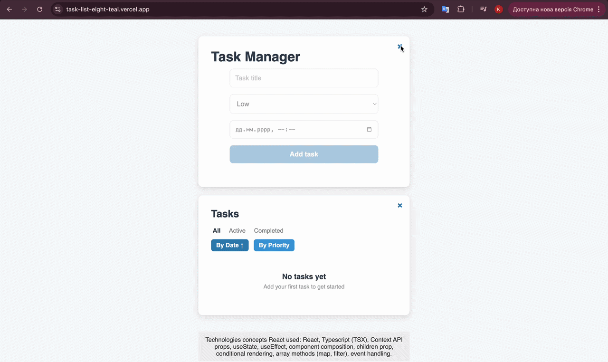
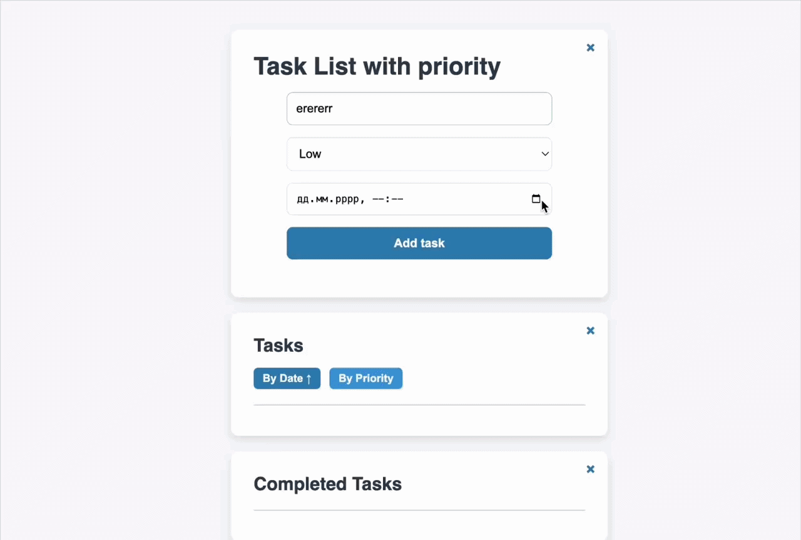

# 📒 Task Manager (React)

A task management application built with React and TypeScript, focused on scalable state management, reusable logic, and clean component architecture.

---

🎬 Preview 

<p align="center"> 
  
</p>

---

## 🚀 Core Features
- Add / delete / complete tasks
- Priority system (Low / Medium / High)
- Sorting (by date and priority)
- Inline editing with keyboard support
- Persistent state (localStorage)
- Deadline tracking with real-time overdue detection

---

## 🧠 Tech Stack

- React (functional components + hooks)
- TypeScript (strong typing for state, context, and component props)
- Context API (state management)
- Vite
- CSS

---

## 🔧 UX & Improvements
- Filtered views (All / Active / Completed)
- Clean empty states

---

## 🌐 Live Demo

https://task-list-eight-teal.vercel.app/

---

## 🧩 Architecture & Decisions

### ❗ Problem: Prop Drilling

Initially, state and logic were placed inside the main App component.
As the application grew, data had to be passed through multiple levels of components, which made the code harder to maintain.

### ✅ Solution: Context API

To solve this, I introduced the Context API and moved the state logic into a separate provider.

This allowed:

- elimination of unnecessary prop passing

---

### ❗ Problem: Repetitive Context Usage

Using useContext directly in multiple components led to duplicated logic and repeated null checks.

This made components harder to read and increased cognitive load when working with the codebase.

📸 Before
<p align="center">
  
  
  
</p>

### ✅ Solution: Custom Hook

To simplify this, I extracted the context logic into a reusable custom hook:

👉 [useTaskContext hook](https://github.com/KIB101D/Task-List/blob/main/src/hooks/useTaskContext.ts)

Now components can access context cleanly:

```ts
const { addTask } = useTaskContext();
```

🎥 After (Real Usage)
<p align="center">  </p>


💡 Instead of repetitive boilerplate across multiple components — a single clean and reusable solution.

### ❗ Problem: Tasks Becoming Outdated

Tasks with deadlines were not updating their status automatically, which could lead to outdated UI.

### ✅ Solution: Time-Based Re-rendering

Introduced a small time-based state update that triggers a re-render every minute, ensuring overdue tasks are recalculated and reflected in the UI without user interaction.

```ts
useEffect(() => {
  const interval = setInterval(() => {
    setTick((t) => t + 1); 
  }, 60000); // one minute

  return () => clearInterval(interval);
}, []);
```

🎥 Example

<p align="center">
  
</p>

---

### 🔧 Refactoring

- extracted business logic from the App component
- separated UI and state management
- organized components into folders

---

## 📦 Installation

```bash
npm install
npm run dev
```
