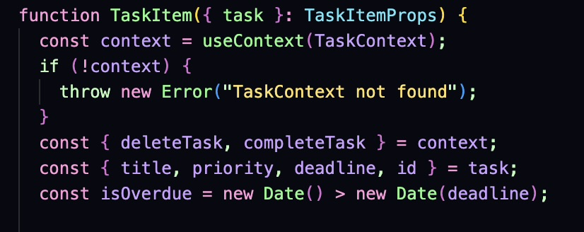
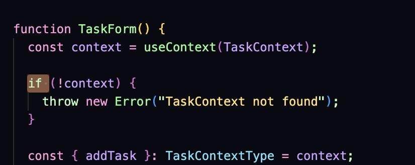
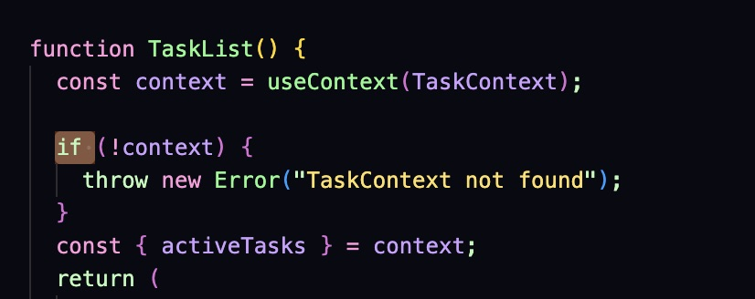
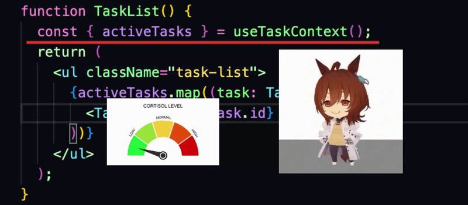

# 📒 Task Manager (React)

A simple but structured task management application built with React.

The goal of this project was not just to implement features, but to improve code structure, state management, and maintainability.

---

## 🚀 Features

- Add / delete / complete tasks
- Priority system (Low / Medium / High)
- Deadline management
- Sorting (by date and priority)
- Real-time overdue detection

---

## 🧠 Tech Stack

- React (functional components + hooks)
- Context API (state management)
- Vite
- CSS

---

## 🌐 Live Demo

https://task-list-eight-teal.vercel.app/

---

## 🧩 Architecture & Decisions

### ❗ Problem: Prop Drilling

Initially, state and logic were placed inside the main App component.
As the application grew, data had to be passed through multiple levels of components, which made the code harder to maintain.

### ✅ Solution: Context API

To solve this, I introduced the Context API and moved the state logic into a separate provider.

This allowed:

- elimination of unnecessary prop passing

---

### ❗ Problem: Repetitive Context Usage

Using useContext directly in multiple components led to duplicated logic and repeated null checks.

This made components harder to read and increased cognitive load when working with the codebase.

📸 Before
<p align="center">
  
  
  
</p>

### ✅ Solution: Custom Hook

To simplify this, I extracted the context logic into a reusable custom hook:

👉 [useTaskContext hook](https://github.com/KIB101D/Task-List/blob/main/src/hooks/useTaskContext.ts)

Now components can access context cleanly:

```ts
const { addTask } = useTaskContext();
```

🎥 After (Real Usage)
<p align="center">  </p>


💡 Instead of repetitive boilerplate across multiple components — a single clean and reusable solution.

---

### 🔧 Refactoring

- extracted business logic from the App component
- separated UI and state management
- organized components into folders

---

## 📦 Installation

```bash
npm install
npm run dev
```

---

## 📌 Future Improvements

- better UX for editing tasks
- animations
- improved error handling
